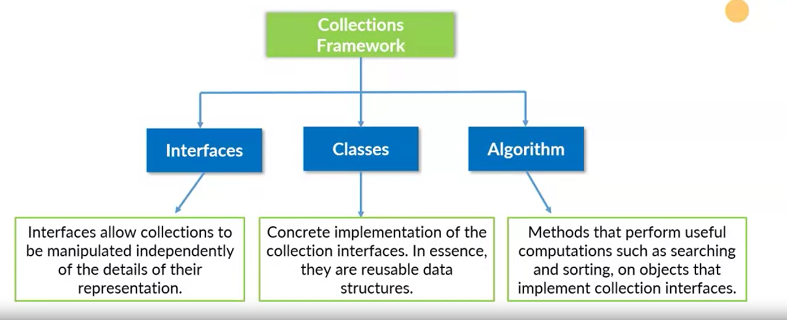
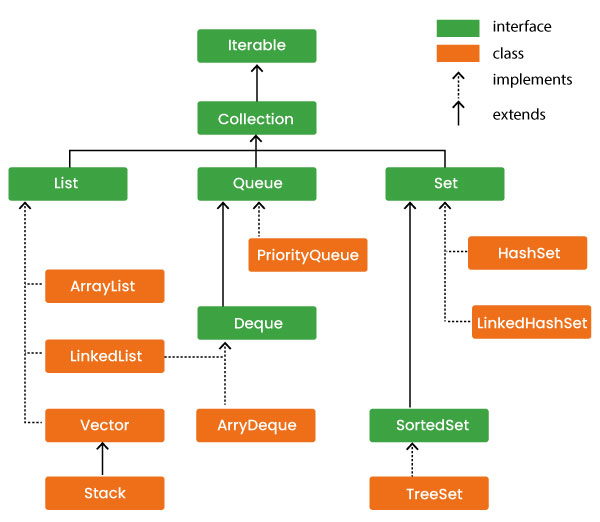

## Collections in Java

The **Collections Framework** in Java provides a unified architecture for handling groups of objects, allowing developers to store, retrieve, manipulate, and communicate aggregate data efficiently. It offers various interfaces, classes, and methods to deal with collections of data, eliminating the need to design custom data structures for standard use cases.

[Collection framework in 1 vedio yt](https://www.youtube.com/watch?v=rzA7UJ-hQn4)

Java collections make development faster and more efficient, providing well-optimized, ready-made data structures that simplify coding and improve performance and scalability. 

### Key Components of the Collections Framework

The Collections Framework is primarily composed of:

1. **Interfaces**: Abstract data types that represent collections. Common interfaces include `List`, `Set`, `Queue`, and `Map`.
2. **Implementations (Classes)**: Concrete classes that implement the collection interfaces, providing specific functionalities like `ArrayList`, `HashSet`, and `HashMap`.
3. **Algorithms**: Useful methods for performing operations on collections, such as sorting and searching, usually implemented as static methods in the `Collections` class.



The **Java Collection Framework** is a comprehensive architecture to manage a group of objects in Java, providing interfaces, classes, and algorithms to handle and manipulate collections efficiently. Here's a breakdown:

### 1. Interfaces

The core of the Java Collection Framework lies in its interfaces, which define the essential types of collections:

 - **Collection**: The root interface for most of the collection classes. It represents a group of objects, known as elements.

- **List**: An ordered collection (or sequence) that allows duplicates. Common implementations include `ArrayList`, `LinkedList`, and `Vector`.

- **Set**: A collection that does not allow duplicate elements. Notable implementations are `HashSet`, `LinkedHashSet`, and `TreeSet`.

- **Queue**: Represents collections designed to hold elements before processing. Important implementations include `PriorityQueue` and `ArrayDeque`.

 - **Map**: Not a subtype of `Collection` but part of the framework, representing key-value pairs. Important classes are `HashMap`, `LinkedHashMap`, and `TreeMap`.

    Each of these interfaces may have multiple implementations, each suited to different use cases.

    ### 2. Classes

    Java Collection Framework provides several concrete classes for these interfaces. Key classes include:

    - **ArrayList**: A dynamic array that grows as needed, ideal for read-heavy applications but not synchronized.

    - **LinkedList**: A doubly-linked list implementation that works well with frequent insertion and deletion.

    - **HashSet**: Implements the `Set` interface with a hash table, offering constant-time performance for basic operations, but it does not guarantee order.

    - **TreeSet**: A sorted `Set` implementation, which uses a red-black tree for ordering and allows ordered traversal of elements.

    - **HashMap**: Implements `Map` with a hash table, providing constant-time performance for inserting and locating elements by key.

    - **TreeMap**: Implements a `Map` sorted in natural order or by a custom comparator, with O(log n) time complexity for insertions and lookups.

    ### 3. Algorithms

    The Java Collections Framework includes many algorithms to manipulate and operate on collections, primarily provided by the `Collections` utility class:

    - **Sorting**: `Collections.sort()` sorts `List` implementations either in natural order or using a custom comparator.

    - **Shuffling**: `Collections.shuffle()` randomly permutes the elements in a list.

    - **Searching**: `Collections.binarySearch()` performs a binary search on sorted lists.

    - **Max and Min**: `Collections.max()` and `Collections.min()` retrieve the maximum or minimum element from a collection.

    - **Frequency Counting**: `Collections.frequency()` returns the frequency of a specified element in a collection.

    - **Unmodifiable Collections**: Methods like `Collections.unmodifiableList()` return unmodifiable versions of collections, making them read-only.

    ### Summary

    The Java Collection Framework is versatile, providing powerful, reusable data structures and algorithms to simplify programming tasks. By offering standardized, high-performance implementations of widely used data structures, the framework allows developers to focus more on business logic than on implementation details. This framework is essential in building efficient, readable, and maintainable Java applications.
---



### Core Interfaces in Java Collections

#### 1. List
- **Characteristics**: 
  - Ordered collection that allows duplicate elements.
  - Elements can be accessed by their index, starting from zero.
- **Common Implementations**: 
  - `ArrayList`: Resizable array; provides fast random access.
  - `LinkedList`: Doubly linked list; provides better performance for insertion/deletion.
  - `Vector`: Synchronized variant of `ArrayList`.
- **Use Case**: Suitable for scenarios where you need ordered elements and frequent access by index.

#### 2. Set
- **Characteristics**: 
  - Collection that doesn’t allow duplicate elements.
  - Does not maintain any particular order of elements (unless using `LinkedHashSet` or `TreeSet`).
- **Common Implementations**: 
  - `HashSet`: Backed by a hash table; fast for insertion, deletion, and search.
  - `LinkedHashSet`: Maintains insertion order.
  - `TreeSet`: Sorted set implemented as a Red-Black tree.
- **Use Case**: Ideal when uniqueness of elements is required, such as storing unique user IDs.

#### 3. Queue
- **Characteristics**: 
  - Typically represents a collection designed to hold elements before processing (FIFO - First In, First Out).
  - `Deque` (Double-Ended Queue) allows insertion and removal from both ends.
- **Common Implementations**:
  - `LinkedList`: Doubles as a Queue implementation.
  - `PriorityQueue`: Orders elements based on natural ordering or a comparator.
  - `ArrayDeque`: Efficient implementation of a Deque.
- **Use Case**: Best suited for scenarios that require processing tasks in the order they are received, like task scheduling or buffering.

#### 4. Map
- **Characteristics**:
  - Collection of key-value pairs, where each key is unique.
  - Allows efficient retrieval, insertion, and deletion of mappings based on keys.
- **Common Implementations**:
  - `HashMap`: Unordered map implementation with fast access.
  - `LinkedHashMap`: Maintains insertion order.
  - `TreeMap`: Sorted map implementation based on keys.
- **Use Case**: Useful for storing relationships, like mapping a student ID to a name, where you need to retrieve values based on unique keys.

---

### Collections Utility Class

Java’s `Collections` class offers several utility methods to perform operations on collections, such as:

- **Sorting**: `Collections.sort(list)` - sorts elements in natural order or by a custom comparator.
- **Searching**: `Collections.binarySearch(list, key)` - performs binary search on sorted lists.
- **Shuffling**: `Collections.shuffle(list)` - randomly permutes the elements.
- **Reversing**: `Collections.reverse(list)` - reverses the order of elements in a list.
  
These utility methods improve productivity by providing out-of-the-box functionalities for common tasks.

---

### Advantages of Java Collections Framework

1. **Consistency**: All collections implement a common set of interfaces, providing a standard way to manipulate different types of collections.
2. **Reusability**: The framework’s collection classes can be reused across different applications, reducing redundancy.
3. **Efficiency**: Data structures like `HashMap` and `ArrayList` offer optimized algorithms for various operations.
4. **Flexibility**: Collections are dynamic; for example, lists like `ArrayList` automatically resize as elements are added.
5. **Enhanced Functionality with Streams**: The Collections Framework integrates seamlessly with Java’s Stream API, allowing functional-style operations like filtering, mapping, and reducing on collections.

---

### Example Code Snippet

Here’s a simple example using a few common collections:

```java
import java.util.*;

public class CollectionsExample {
    public static void main(String[] args) {
        // List Example
        List<String> fruits = new ArrayList<>();
        fruits.add("Apple");
        fruits.add("Banana");
        fruits.add("Apple"); // Allows duplicate
        System.out.println("List: " + fruits);

        // Set Example
        Set<String> uniqueFruits = new HashSet<>(fruits); // Removes duplicates
        System.out.println("Set: " + uniqueFruits);

        // Map Example
        Map<String, Integer> fruitCalories = new HashMap<>();
        fruitCalories.put("Apple", 95);
        fruitCalories.put("Banana", 105);
        System.out.println("Map: " + fruitCalories);

        // Queue Example
        Queue<String> queue = new LinkedList<>();
        queue.add("First");
        queue.add("Second");
        System.out.println("Queue: " + queue.poll()); // Outputs "First"
    }
}
```

---

### Summary

The Collections Framework in Java provides a powerful, standardized approach to handling groups of objects, with flexible structures like `List`, `Set`, `Queue`, and `Map` that can be customized based on application requirements. This framework greatly simplifies data manipulation, improving both code readability and efficiency.